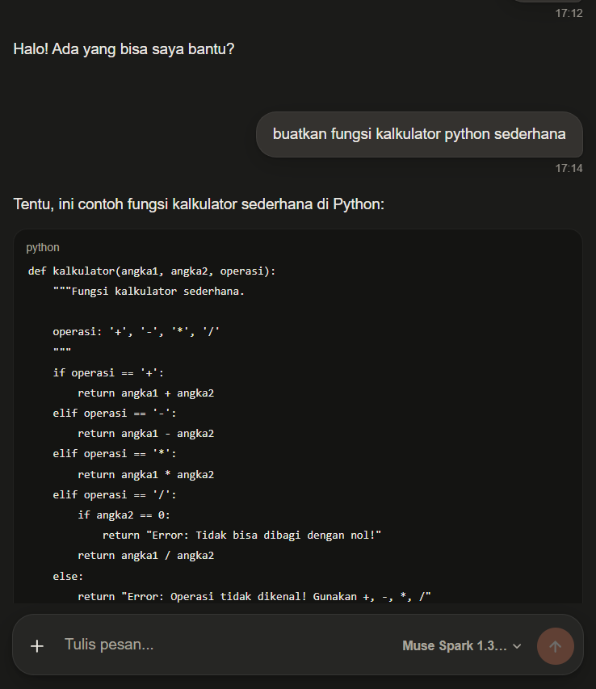

# just-chat

Room chat AI bergaya Claude web. Bubble user di kanan, jawaban AI di kiri, respons di-stream kata per kata seperti mengetik.

Dibangun dengan React + Vite, tanpa komponen UI pihak ketiga — semua dijual tangan: markdown renderer, auto-scroll, state chat, animasi stream. Backend-nya OpenAI-compatible, jadi bisa nempel ke 9Router, OpenAI, atau server lokal apa pun yang sejenis.




## Yang ada di dalamnya

- **Streaming nyata** — token muncul satu per satu dengan fade halus per kata dan kursor kedip. Fence ```` ``` ```` yang belum ditutup pun langsung tampil sebagai code block, jadi tidak perlu nunggu penulisannya selesai.
- **Tombol stop** — kirim berubah jadi stop saat respons berjalan. Yang sudah terlanjur masuk tetap disimpan sebagai pesan final.
- **Regenerate** — pakai tombol ↻ di bawah jawaban AI, prompt user dikirim ulang di bawahnya tanpa menghapus jawaban lama.
- **Teksan kaya** — bold, inline code, tautan, heading, blockquote, `hr`, list bulat dan bernomor, plus code block dengan label bahasa dan tombol salin sendiri.
- **Pemilih model** — daftar model diambil dari `src/config/models.js`, ganti pilihan langsung ganti model request.
- **Lampiran** — tombol `+` untuk pilih foto atau file, nama file ikut terkirim bersama pesan.
- **Label balasan** — "35 detik yang lalu | 26 token/s" yang dihitung dari durasi stream dan perkiraan token.
- **Auto-scroll pintar** — halaman mengikuti jawaban baru, tapi berhenti ikut begitu kamu scroll ke atas untuk membaca ulang.

## Menjalankan

Butuh Node 20+. Semua request AI lewat proxy same-origin di `server.cjs` supaya bebas masalah CORS.

```bash
npm install
npm run dev      # http://localhost:5173, /v1 diproxy ke 127.0.0.1:20128
```

Untuk mode produksi:

```bash
npm run build
npm run serve    # http://localhost:8081
```

`npm run serve` menyajikan hasil build dari `dist/` sekaligus memproyeksikan `/v1/*` ke gateway AI.

## Konfigurasi

Endpoint dan API key ada di `src/lib/api.js`:

```js
export const API_BASE = window.location.protocol === 'file:' ? 'http://localhost:20128/v1' : '/v1';
export const API_KEY = 'sk-...';
```

Daftar model ada di `src/config/models.js`. Label di sini yang dipakai untuk tampilan:

```js
export const DEFAULT_MODEL = 'oc/muse-spark-1.3-contributor-free';

export const FALLBACK_MODELS = [
  { id: 'oc/mimo-v2.6-flash-free', label: 'Mimo V2.6' },
  { id: 'oc/muse-spark-1.3-contributor-free', label: 'Muse Spark' }
];
```

## Struktur

```
src/
  App.jsx                     susun daftar pesan + composer
  main.jsx                    entry, mount React
  config/models.js            daftar model + label
  hooks/
    useChat.js                state chat, stream, stop, regenerate, scroll
    useCodeCopy.js            tombol salin untuk tiap code block
  lib/
    api.js                    klien SSE + fetch model
    markdown.js               parser markdown + pembungkus kata untuk animasi
    time.js                   waktu relatif dan hitung token/s
    icons.jsx                 ikon SVG inline
  components/
    UserMessage.jsx           bubble kanan
    AiMessage.jsx             jawaban AI selesai + aksi
    StreamMessage.jsx         jawaban AI yang sedang mengalir
    ThinkingRow.jsx           indikator titik saat menunggu
    Composer.jsx              input, lampiran, pilih model, tombol kirim/stop
```

## Catatan

Angka token per detik adalah estimasi dari jumlah kata dikali 1,3 dibagi durasi stream. Gateway tidak mengirim hitungan token asli saat streaming, jadi angkanya mendekati, bukan eksak.
